# EDU AI — System Documentation

**Version:** 2.0  
**Date:** 2026-06-06  
**Platform:** AI-Powered Interview & Hiring Platform  
**Institution:** LNCT Bhopal

---

## Table of Contents

1. [Software Requirements Specification (SRS)](#1-software-requirements-specification)
2. [System Architecture Diagram](#2-system-architecture-diagram)
3. [Technical Component Diagram](#3-technical-component-diagram)
4. [Network & Infrastructure Diagram](#4-network--infrastructure-diagram)
5. [Data Flow Diagrams](#5-data-flow-diagrams)
6. [Process Flowcharts](#6-process-flowcharts)
7. [AI Avatar Interview — Feature Spec](#7-ai-avatar-interview--feature-spec)
8. [Upcoming Features](#8-upcoming-features)
9. [Data Models (ER Diagram)](#9-data-models--er-diagram)
10. [API Surface Summary](#10-api-surface-summary)

---

## 1. Software Requirements Specification

### 1.1 Introduction

#### 1.1.1 Purpose
This document specifies the functional and non-functional requirements for EDU AI, an AI-powered recruitment and interview platform. It covers the current implemented system, features under active development, and planned future capabilities.

#### 1.1.2 Scope
EDU-AI is a multi-role web platform designed for:
- **Educational institutions** to conduct proctored assessments, quizzes, and coding contests
- **Companies** to post jobs, screen candidates via ATS, and run AI-powered interviews
- **Candidates** to practice coding, attend AI interviews, and track applications
- **Recruiters & Admins** to manage hiring pipelines and platform governance

#### 1.1.3 Definitions

| Term | Definition |
|------|-----------|
| ATS | Applicant Tracking System — automated resume scoring engine |
| Proctoring | Real-time monitoring of interview/exam integrity via face detection |
| AI Avatar | AI-generated animated interviewer persona conducting video interviews |
| LangGraph | Stateful AI workflow orchestration library used in Resume Verifier v2 |
| Trust Score | Composite confidence score (0–100) computed by Resume Verifier v2 |
| OTP | One-Time Password used for email verification |
| CSRF | Cross-Site Request Forgery protection token |

#### 1.1.4 System Overview

```
┌─────────────────────────────────────────────────────────────────┐
│                         EDU-AI Platform                          │
│                                                                  │
│  ┌──────────────┐  ┌──────────────┐  ┌──────────────────────┐  │
│  │   Candidate  │  │   Company /  │  │   Admin / Proctor /  │  │
│  │   Portal     │  │   Recruiter  │  │   Scoring Panel      │  │
│  └──────────────┘  └──────────────┘  └──────────────────────┘  │
│         │                  │                     │               │
│  ┌──────▼──────────────────▼─────────────────────▼───────────┐  │
│  │              Main Backend API (Node.js + Express)          │  │
│  └────────────────────────────────────────────────────────────┘  │
│         │                  │                     │               │
│  ┌──────▼──────┐  ┌────────▼──────┐  ┌──────────▼──────────┐  │
│  │  MongoDB    │  │ Resume        │  │  Whiteboard          │  │
│  │  Redis      │  │ Verifier v2   │  │  (Coming Soon)       │  │
│  │  Pinecone   │  │ (FastAPI)     │  │                      │  │
│  └─────────────┘  └───────────────┘  └─────────────────────┘   │
└─────────────────────────────────────────────────────────────────┘
```

---

### 1.2 Functional Requirements

#### FR-01: Authentication & Identity
| ID | Requirement | Status |
|----|-------------|--------|
| FR-01.1 | System shall support OTP-based email registration | ✅ Implemented |
| FR-01.2 | System shall support password login with PBKDF2 (100k iterations) | ✅ Implemented |
| FR-01.3 | System shall support face recognition login via vector search | ✅ Implemented |
| FR-01.4 | System shall issue JWT tokens as HTTP-only cookies (7-day expiry) | ✅ Implemented |
| FR-01.5 | System shall enforce role-based access control (6 roles) | ✅ Implemented |
| FR-01.6 | System shall provide forgot-password and reset-password flows | ✅ Implemented |

#### FR-02: Job & ATS Management
| ID | Requirement | Status |
|----|-------------|--------|
| FR-02.1 | Companies shall be able to create jobs with ATS eligibility criteria | ✅ Implemented |
| FR-02.2 | System shall auto-score resumes against job criteria (5-component ATS) | ✅ Implemented |
| FR-02.3 | System shall support bulk shortlisting by ATS threshold | ✅ Implemented |
| FR-02.4 | System shall track application status through 9-stage pipeline | ✅ Implemented |

#### FR-03: AI Interview
| ID | Requirement | Status |
|----|-------------|--------|
| FR-03.1 | System shall generate role-specific interview questions via Groq AI | ✅ Implemented |
| FR-03.2 | System shall evaluate and score candidate answers in real-time | ✅ Implemented |
| FR-03.3 | System shall generate post-interview reports with feedback | ✅ Implemented |
| FR-03.4 | System shall provide AI Avatar interviewer persona | 🔄 In Progress |
| FR-03.5 | System shall support practice interview mode | ✅ Implemented |

#### FR-04: Proctoring
| ID | Requirement | Status |
|----|-------------|--------|
| FR-04.1 | System shall detect and log tab switches during interviews | ✅ Implemented |
| FR-04.2 | System shall detect multiple faces via face-api.js | ✅ Implemented |
| FR-04.3 | System shall calculate integrity score with diminishing-returns algorithm | ✅ Implemented |
| FR-04.4 | System shall persist proctoring events per interview session | ✅ Implemented |

#### FR-05: Coding Platform
| ID | Requirement | Status |
|----|-------------|--------|
| FR-05.1 | System shall execute code in JavaScript, Python, C++, Java | ✅ Implemented |
| FR-05.2 | System shall host real-time coding contests via WebSocket | ✅ Implemented |
| FR-05.3 | System shall generate AI hints and code analysis | ✅ Implemented |
| FR-05.4 | System shall host real-time AI-generated quizzes | ✅ Implemented |

#### FR-06: Resume Verification (Microservice)
| ID | Requirement | Status |
|----|-------------|--------|
| FR-06.1 | Service shall parse GitHub repositories to verify resume claims | ✅ Implemented |
| FR-06.2 | Service shall perform AST-level code analysis via Tree-sitter | ✅ Implemented |
| FR-06.3 | Service shall compute weighted trust score (0–100) | ✅ Implemented |
| FR-06.4 | Service shall generate detailed verification reports | ✅ Implemented |
| FR-06.5 | Frontend integration with main platform | ⬜ Not Integrated |

#### FR-07: AI Doubt Solver with Live Whiteboard
| ID | Requirement | Status |
|----|-------------|--------|
| FR-07.1 | System shall accept a student's natural-language question and stream a live concept map | ✅ Built (standalone) |
| FR-07.2 | LLM shall generate hierarchical concept maps with min 20 nodes and 4 depth levels | ✅ Built (standalone) |
| FR-07.3 | System shall stream draw commands (node/arrow/equation/code) via SSE in real-time | ✅ Built (standalone) |
| FR-07.4 | Student shall be able to export the concept map as a PNG | ✅ Built (standalone) |
| FR-07.5 | Whiteboard app shall be integrated into the main EDU AI platform dashboard | ⬜ Not Integrated |

---

### 1.3 Non-Functional Requirements

| Category | Requirement |
|----------|-------------|
| **Performance** | API response time < 200ms for non-AI endpoints (p95) |
| **Performance** | AI endpoints (Groq/Gemini) timeout after 60 seconds |
| **Security** | All endpoints behind CSRF, rate limiting, and security headers |
| **Security** | File uploads validated by type and size (10 MB max) |
| **Availability** | System degrades gracefully when Redis is offline |
| **Scalability** | Stateless backend — horizontally scalable behind load balancer |
| **Observability** | Winston logging to files + console; Sentry integration available |
| **Compatibility** | Frontend supports modern browsers (Chrome 90+, Firefox 90+, Safari 14+) |
| **Accessibility** | WCAG 2.1 AA compliance target for all public-facing pages |

---

### 1.4 Roles & Permissions

| Role | Description | Key Permissions |
|------|-------------|-----------------|
| `candidate` | Job seeker / student | Apply to jobs, take AI interviews, coding practice, view own analytics |
| `company_admin` | Company account owner | Create jobs, view all applicants, manage company profile |
| `company_hr` | HR staff | View applicants, update application status, schedule interviews |
| `recruiter` | External recruiter | View assigned candidates, move pipeline stages |
| `proctor` | Exam supervisor | View proctoring dashboard, flag incidents |
| `admin` | Platform administrator | Full access, manage all users, global AI config, audit logs |

---

## 2. System Architecture Diagram

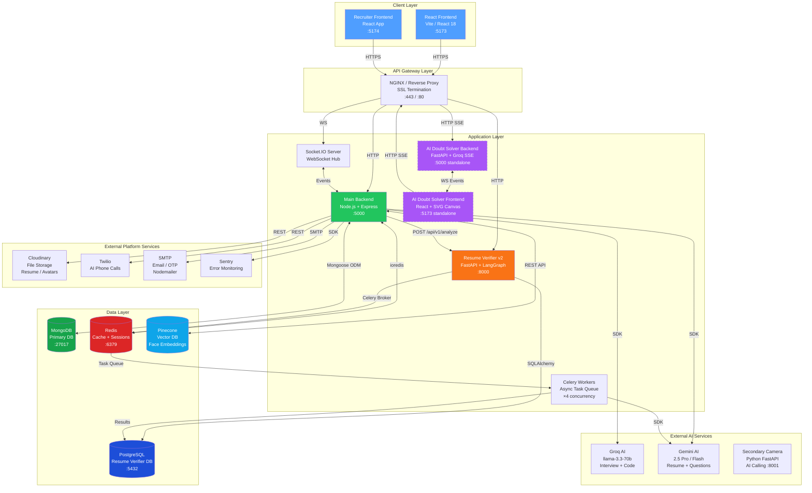

---

## 3. Technical Component Diagram

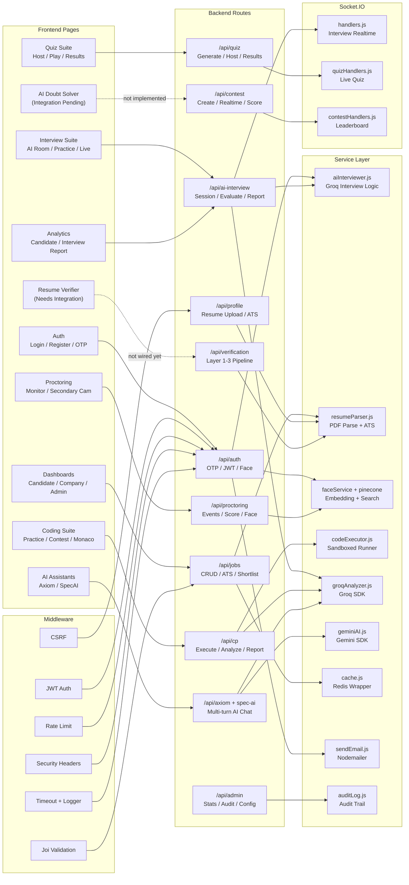

---

## 4. Network & Infrastructure Diagram

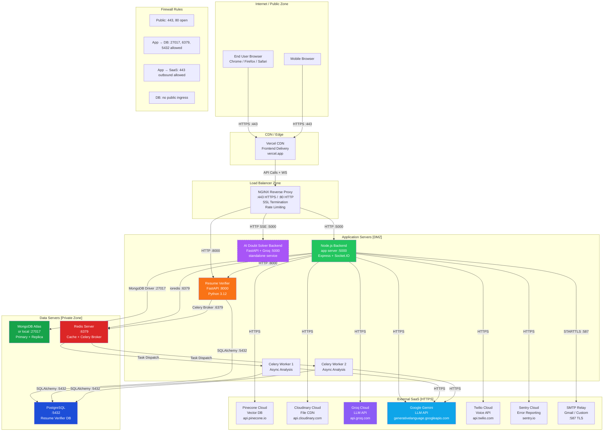

---

## 5. Data Flow Diagrams

### 5.1 Authentication Data Flow

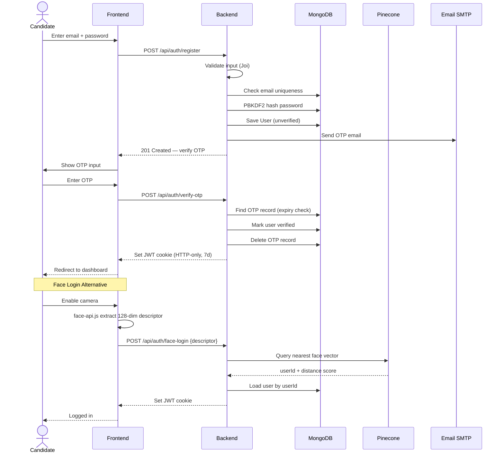

### 5.2 ATS Scoring Data Flow

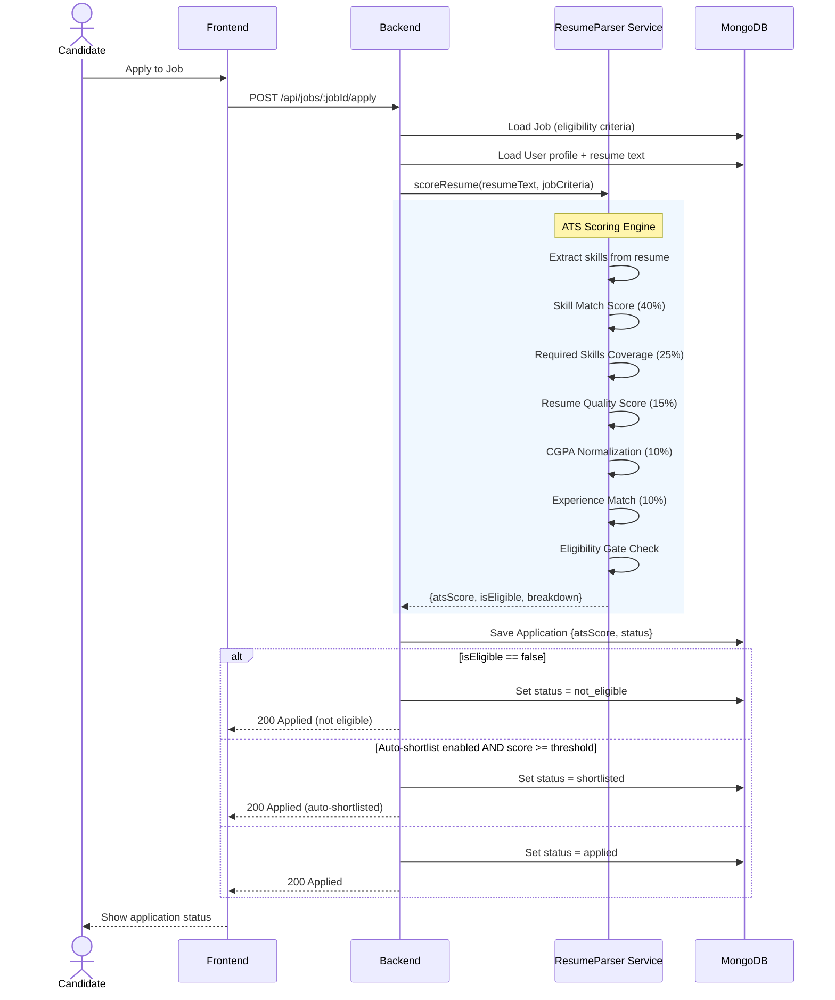

### 5.3 Resume Verification Data Flow

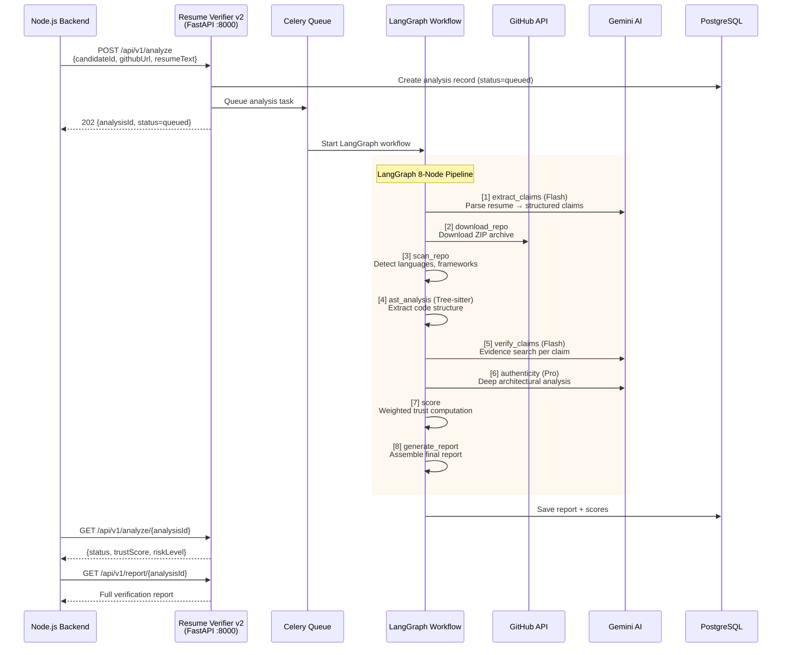

### 5.4 LangGraph StateGraph — Resume Verifier v2

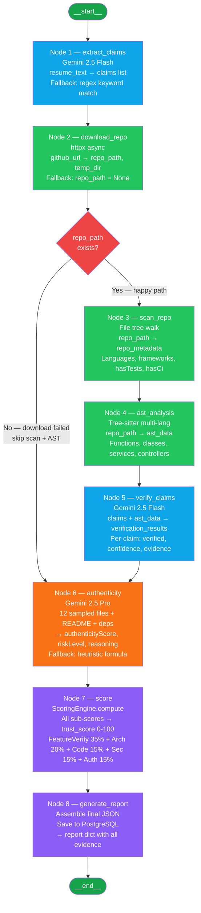

---

## 6. Process Flowcharts

### 6.1 AI Interview Flow

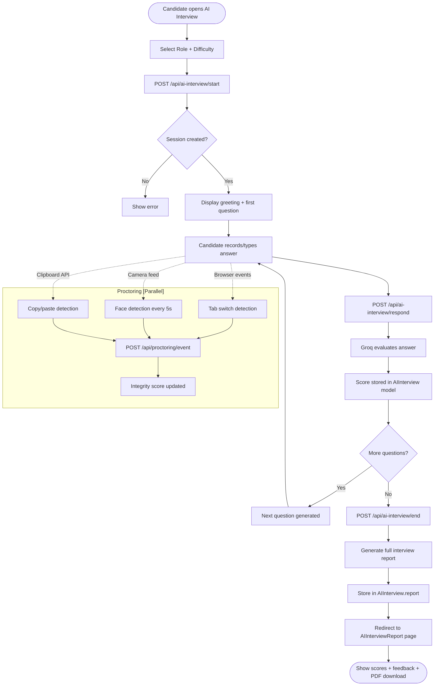

### 6.2 Coding Contest Flow

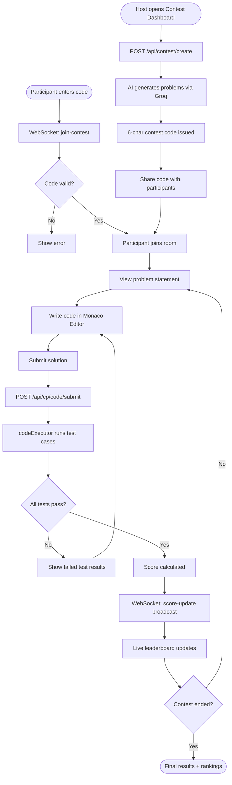

### 6.3 Application Pipeline Flow

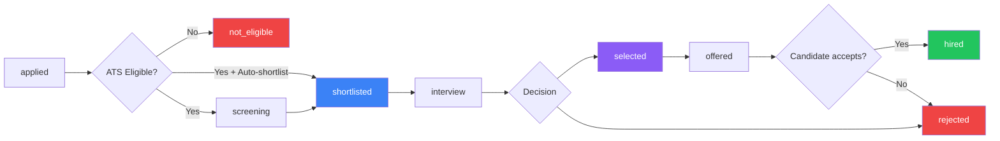

### 6.4 Live Quiz Flow

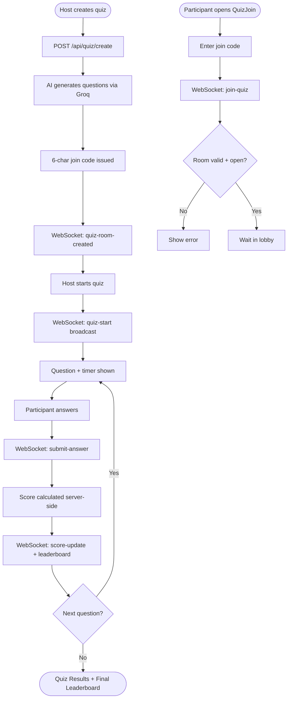

---

## 7. AI Avatar Interview — Feature Spec

### 7.1 Overview

The AI Avatar Interview feature replaces the static text-chat interface with an animated AI interviewer persona. The avatar speaks questions aloud, listens to spoken candidate responses, and provides a human-like interview experience.

### 7.2 Feature Architecture

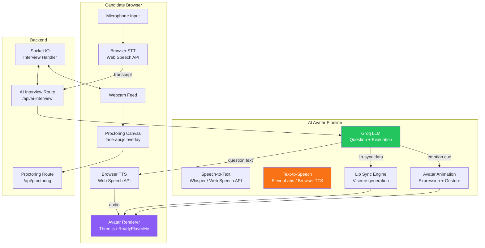

### 7.3 Avatar Interview Screen Layout

```
┌─────────────────────────────────────────────────────────────┐
│  EDU AI AI Interview         [● REC]  [Integrity: 94%]   │
├──────────────────────────┬──────────────────────────────────┤
│                          │                                  │
│   AI AVATAR (3D/2D)      │   CANDIDATE VIDEO FEED           │
│   ┌──────────────────┐   │   ┌──────────────────────────┐  │
│   │                  │   │   │                          │  │
│   │   [Avatar Face]  │   │   │   [Webcam Stream]        │  │
│   │   Speaking...    │   │   │   Face Detection Active  │  │
│   │   🟢 Lip-sync    │   │   │                          │  │
│   └──────────────────┘   │   └──────────────────────────┘  │
│                          │                                  │
├──────────────────────────┴──────────────────────────────────┤
│  Q3 / 8 ──────────────────────────── 01:23 remaining       │
│                                                              │
│  "Explain the difference between REST and GraphQL APIs."    │
│                                                              │
├──────────────────────────────────────────────────────────────┤
│  [🎙 Speaking... (auto-detect)]    [Skip]   [End Interview] │
└─────────────────────────────────────────────────────────────┘
```

### 7.4 Implementation Plan

| Step | Task | Tech |
|------|------|------|
| 1 | Integrate Web Speech API for STT | Browser native / Whisper API |
| 2 | Pipe transcript to `/api/ai-interview/respond` | Existing endpoint |
| 3 | Receive AI question text + evaluate response | Groq LLM (existing) |
| 4 | Text-to-Speech output | Browser SpeechSynthesis / ElevenLabs |
| 5 | Load 3D avatar model | Ready Player Me / Three.js |
| 6 | Generate lip-sync visemes from TTS audio | Rhubarb Lip Sync / phoneme mapping |
| 7 | Animate avatar expressions based on question sentiment | LLM emotion tag → animation state |
| 8 | Maintain proctoring overlay | face-api.js (existing) |

### 7.5 API Contract Changes

**New field on `/api/ai-interview/start` response:**
```json
{
  "sessionId": "uuid",
  "avatarId": "professional_female_01",
  "greetingText": "Hello! I am Aria, your AI interviewer...",
  "greetingAudioUrl": "https://cdn.hirespec.ai/tts/greeting_abc.mp3",
  "firstQuestion": { "text": "...", "audioUrl": "..." }
}
```

**New field on `/api/ai-interview/respond` response:**
```json
{
  "score": 8.2,
  "nextQuestion": {
    "text": "Tell me about a challenging project...",
    "audioUrl": "https://cdn.hirespec.ai/tts/q4_xyz.mp3",
    "emotionCue": "curious",
    "visemes": [{ "time": 0.1, "value": "AA" }, ...]
  }
}
```

---

## 8. Upcoming Features

### 8.1 AI Doubt Solver with Live Whiteboard ✅ Built (Integration Pending)

#### 8.1.1 Overview

The AI Doubt Solver is a **standalone educational micro-app** — not a collaborative drawing tool. A student types any question (e.g. "Explain recursion" or "Trees vs Graphs"), and the system streams back a **live hierarchical concept map** rendered as an SVG graph that builds up in real-time as the LLM generates it.

**What it actually is:**
- Student asks a doubt in natural language
- FastAPI backend streams to Groq LLM (`llama-3.3-70b-versatile`)
- Groq responds with **JSON-Lines draw commands** (`node`, `arrow`, `equation`, `code`, `mermaid`)
- React frontend renders a live concept map (min 20–35 nodes, 4+ levels deep) via SVG
- Multi-turn conversation history supported
- Export concept map as PNG

**What it is NOT:** It is not a collaborative hand-drawing whiteboard for interviews.

**Current state:** Backend (FastAPI) and Frontend (React) are both fully built as a standalone app. Integration into the main EDU AI platform dashboard is pending.

#### 8.1.2 Architecture

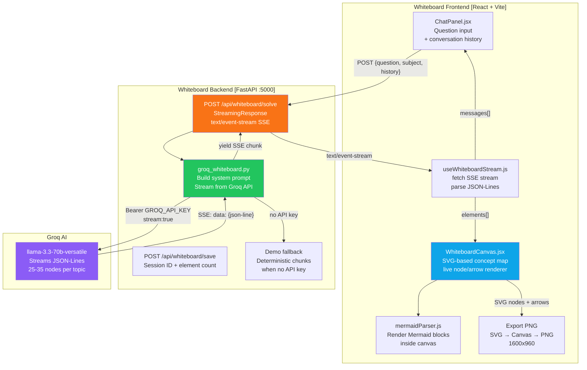

#### 8.1.3 SSE Streaming Protocol

The backend uses **Server-Sent Events (SSE)** — not WebSockets. The LLM streams JSON-Lines; each line is one draw command:

| Chunk Type | Example Payload | Frontend Action |
|------------|----------------|-----------------|
| `draw / clear` | `{"type":"draw","command":"clear","data":{}}` | Clear SVG canvas |
| `draw / node` | `{"type":"draw","command":"node","data":{"id":"root","title":"Trees","color":"#6366f1","parent":null}}` | Add node to graph |
| `draw / arrow` | `{"type":"draw","command":"arrow","data":{"from":"root","to":"leaf"}}` | Draw edge between nodes |
| `draw / equation` | `{"type":"draw","command":"equation","data":{"latex":"O(n^2)"}}` | Render LaTeX |
| `draw / code` | `{"type":"draw","command":"code","data":{"language":"python","snippet":"..."}}` | Code block on canvas |
| `draw / mermaid` | `{"type":"draw","command":"mermaid","data":{"code":"graph LR..."}}` | Mermaid sub-diagram |
| `text` | `{"type":"text","content":"Let's start with..."}` | Chat message bubble |
| `speak` | `{"type":"speak","content":"Key insight here"}` | Voice-over cue |
| `done` | `{"type":"done"}` | Stream complete |

#### 8.1.4 Concept Map Structure (LLM-enforced)

```
Root Concept (Level 0 — #6366f1)
├── Definition / Core Concept   (Level 1 — #06b6d4)
│   ├── Formal definition       (Level 2 — #10b981)
│   └── Informal explanation    (Level 2 — #10b981)
├── Internal Structure          (Level 1 — #06b6d4)
│   ├── Components              (Level 2 — #10b981)
│   └── Sub-components          (Level 3 — #f59e0b)
├── Key Properties              (Level 1 — #06b6d4)
├── Types / Variants            (Level 1 — #06b6d4)
├── Examples                    (Level 1 — #06b6d4)
├── Advantages                  (Level 1 — #06b6d4)
├── Disadvantages               (Level 1 — #06b6d4)
├── Real-world Applications     (Level 1 — #06b6d4)
├── Comparisons / Trade-offs    (Level 1 — #06b6d4)
└── Interview Takeaways         (Level 1 — #06b6d4)
```

**"vs" topic mode** (e.g. "Trees vs Graphs"): generates two equal-depth side-by-side subtrees.

#### 8.1.5 UI Layout

```
┌─────────────────────────────────────────────────────────────────┐
│  EDU-AI Whiteboard   [Network icon]    [Export PNG]  [Clear]   │
│  Live doubt solving with synchronized diagrams                  │
├──────────────────────────────────────┬──────────────────────────┤
│                                      │                          │
│     SVG CONCEPT MAP CANVAS           │    CHAT PANEL            │
│                                      │                          │
│   [root: Recursion]                  │  Student: Explain        │
│        |                             │  recursion               │
│   [Definition]  [Types]  [Apps]      │                          │
│        |           |        |        │  AI: Let's explore       │
│   [Base Case] [Direct] [Tree Walk]   │  recursion step by step. │
│        |       [Indirect]            │                          │
│   [Recursive] [Mutual]               │  [Streaming...]          │
│     Case                             │                          │
│                                      │  ┌───────────────────┐  │
│   [Advantages] [Disadvantages]       │  │ Type a question..  │  │
│                                      │  │              [Ask] │  │
│                                      │  └───────────────────┘  │
└──────────────────────────────────────┴──────────────────────────┘
```

#### 8.1.6 Integration TODO

| Task | Priority |
|------|----------|
| Embed whiteboard app inside main frontend as an iframe or route | High |
| Add "Open Doubt Solver" button to Candidate Dashboard | High |
| Pass student JWT to whiteboard for session tracking | Medium |
| Store session snapshots linked to user account | Medium |

---

### 8.2 AI Resume Verifier (Platform Integration) ⬜ Not Integrated

> **Note:** The Resume Verifier v2 microservice (FastAPI + LangGraph) is fully built as a standalone service. What's missing is frontend integration and seamless connection to the main hiring pipeline.

#### 8.2.1 Overview
The Resume Verifier automatically validates candidate GitHub project claims against actual code, producing a trust score and detailed evidence report viewable by recruiters.

#### 8.2.2 Integration Architecture

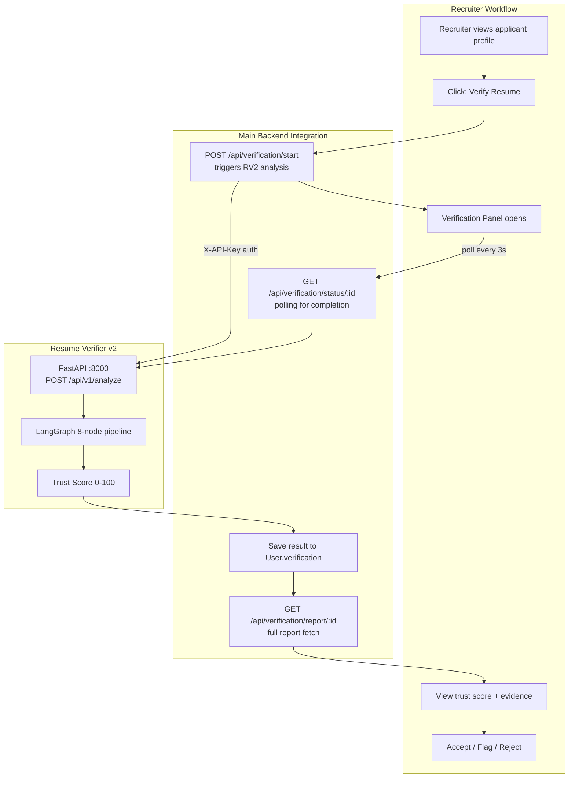

#### 8.2.3 Trust Score Display

```
┌───────────────────────────────────────────────────────────┐
│  Resume Verification Report — John Doe                     │
│                                                           │
│  Trust Score: ████████████░░░░  84.5 / 100   🟢 LOW RISK │
│                                                           │
│  ┌─────────────────┬────────────────────────────────────┐ │
│  │ Feature Verify  │ ████████████████████░░░░  78%      │ │
│  │ Architecture    │ ██████████████████████░░  90%      │ │
│  │ Code Quality    │ ████████████████░░░░░░░░  72%      │ │
│  │ Security        │ ██████████████████░░░░░░  75%      │ │
│  │ Authenticity    │ ████████████████████░░░░  82%      │ │
│  └─────────────────┴────────────────────────────────────┘ │
│                                                           │
│  ✅ Verified Claims (8):                                  │
│     ✓ JWT Authentication     [97% conf] Deep evidence    │
│     ✓ Redis Caching          [91% conf] Deep evidence    │
│     ✓ Docker Containerization [88% conf] Moderate evid.  │
│     ✓ REST API Design        [95% conf] Deep evidence    │
│                                                           │
│  ❌ Unverified Claims (2):                                │
│     ✗ Kubernetes Deployment  — No evidence found         │
│     ✗ ML Model Integration   — No evidence found         │
│                                                           │
│  Recommendation: ✅ PROCEED TO TECHNICAL INTERVIEW        │
│                                                           │
│  [Download Full Report PDF]    [Flag for Review]         │
└───────────────────────────────────────────────────────────┘
```

#### 8.2.4 Integration TODO

| Task | Owner | Priority |
|------|-------|----------|
| Add `POST /api/verification/start` in Node.js backend | Backend | High |
| Wire `ResumeVerification.jsx` to call above endpoint | Frontend | High |
| Add polling UI in `ResumeVerification.jsx` (3s intervals) | Frontend | High |
| Render trust score breakdown chart (ApexCharts) | Frontend | Medium |
| Store verifier result in `User.verification.v2` | Backend | Medium |
| Add "Verify Resume" button to Company applicant view | Frontend | Medium |
| Environment variable: `RESUME_VERIFIER_URL` in Node.js | DevOps | High |

---

## 9. Data Models — ER Diagram

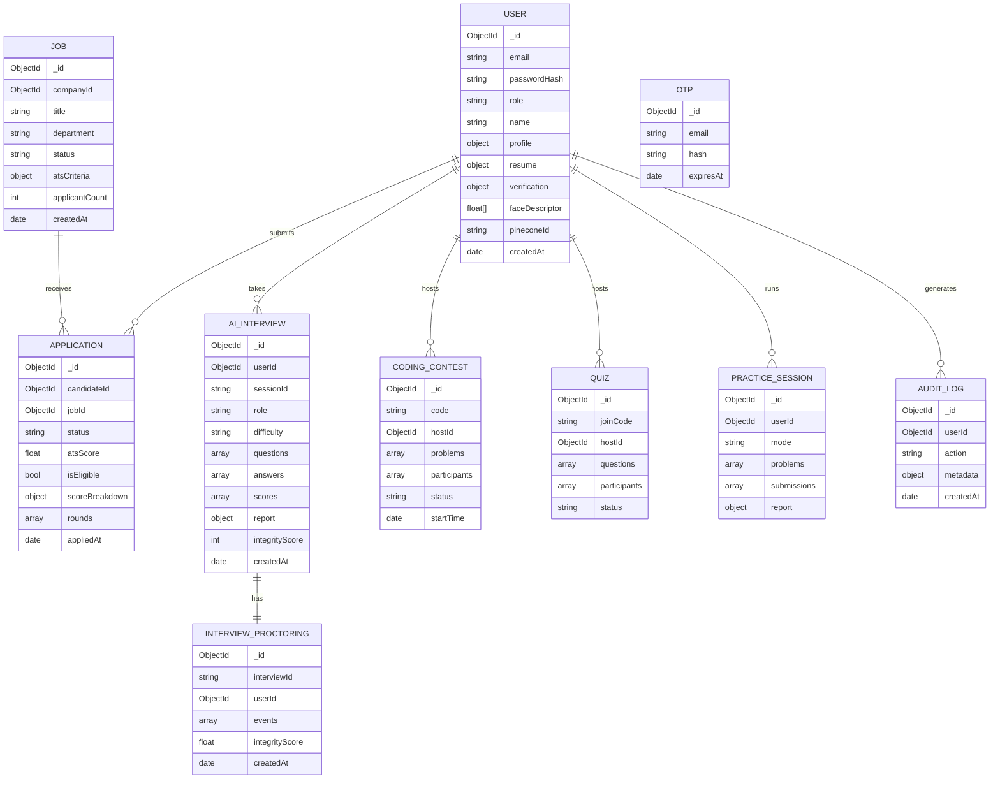

---

## 10. API Surface Summary

### Authentication (`/api/auth`)
| Method | Endpoint | Auth | Description |
|--------|----------|------|-------------|
| POST | `/register` | — | Register + trigger OTP |
| POST | `/verify-otp` | — | Verify OTP → issue JWT |
| POST | `/login` | — | Password login |
| POST | `/face-login` | — | Face descriptor login |
| POST | `/forgot-password` | — | Send reset OTP |
| POST | `/reset-password` | — | Set new password |
| POST | `/logout` | JWT | Clear cookie |
| GET | `/me` | JWT | Current user |

### Jobs & ATS (`/api/jobs`)
| Method | Endpoint | Auth | Description |
|--------|----------|------|-------------|
| GET | `/browse` | JWT | All active jobs |
| POST | `/` | company_admin / hr | Create job |
| PUT | `/:jobId` | company_admin / hr | Update job |
| DELETE | `/:jobId` | company_admin | Delete job |
| POST | `/:jobId/apply` | candidate | Apply + ATS score |
| GET | `/:jobId/applicants` | company | Applicant list |
| POST | `/:jobId/shortlist` | company | Bulk shortlist |
| POST | `/:jobId/rescore` | company | Re-run ATS on all |

### AI Interview (`/api/ai-interview`)
| Method | Endpoint | Auth | Description |
|--------|----------|------|-------------|
| POST | `/start` | JWT | Create session |
| POST | `/respond` | JWT | Submit answer |
| POST | `/end` | JWT | Generate report |
| GET | `/sessions` | JWT | My sessions |
| GET | `/session/:id` | JWT | Session detail |

### Coding Platform (`/api/cp/*`)
| Method | Endpoint | Auth | Description |
|--------|----------|------|-------------|
| POST | `/cp/code/submit` | JWT | Submit code solution |
| POST | `/cp/code/run` | JWT | Run without submitting |
| GET | `/cp/questions` | JWT | Problem list |
| POST | `/cp/questions/generate` | JWT | AI-generate problem |
| GET | `/cp/session` | JWT | Active session |
| GET | `/cp/reports` | JWT | Practice reports |
| POST | `/cp/analysis/analyze` | JWT | Analyze code quality |

### Resume Verifier v2 (`/api/v1` on port 8000)
| Method | Endpoint | Auth | Description |
|--------|----------|------|-------------|
| POST | `/analyze` | API-Key | Queue analysis |
| GET | `/analyze/:id` | API-Key | Poll status |
| GET | `/report/:id` | API-Key | Full report |
| GET | `/health` | — | Service health |

### AI Doubt Solver (`/api/whiteboard` on standalone port 5000)
| Method | Endpoint | Auth | Description |
|--------|----------|------|-------------|
| POST | `/solve` | — | Stream SSE concept map for a question |
| POST | `/save` | — | Save session elements + chat history |
| GET | `/health` | — | Service liveness check |

---

## Appendix A: Environment Variables

| Variable | Service | Required | Description |
|----------|---------|----------|-------------|
| `MONGODB_URI` | Backend | Yes | MongoDB connection string |
| `JWT_SECRET` | Backend | Yes | JWT signing key |
| `GROQ_API_KEY` | Backend | Yes | Groq LLM API key |
| `GEMINI_API_KEY` | Backend | No | Google Gemini API key |
| `PINECONE_FACE_API_KEY` | Backend | Yes | Pinecone face index key |
| `PINECONE_FACE_INDEX` | Backend | Yes | Pinecone index name |
| `CLOUDINARY_CLOUD_NAME` | Backend | Yes | Cloudinary account |
| `CLOUDINARY_API_KEY` | Backend | Yes | Cloudinary API key |
| `CLOUDINARY_API_SECRET` | Backend | Yes | Cloudinary API secret |
| `REDIS_URL` | Backend | No | Redis connection URL |
| `EMAIL_USER` | Backend | No | SMTP email address |
| `EMAIL_PASS` | Backend | No | SMTP app password |
| `TWILIO_ACCOUNT_SID` | Backend | No | Twilio SID |
| `TWILIO_AUTH_TOKEN` | Backend | No | Twilio auth token |
| `TWILIO_PHONE_NUMBER` | Backend | No | Twilio phone number |
| `NGROK_URL` | Backend | No | AI calling webhook URL |
| `SENTRY_DSN` | Backend | No | Sentry error reporting |
| `DATABASE_URL` | Resume Verifier | Yes | PostgreSQL async URL |
| `SYNC_DATABASE_URL` | Resume Verifier | Yes | PostgreSQL sync URL (Celery) |
| `REDIS_URL` | Resume Verifier | Yes | Redis URL (Celery broker) |
| `GEMINI_API_KEY` | Resume Verifier | Yes | Gemini API key |
| `API_KEY` | Resume Verifier | Yes | Shared secret with Node.js |

---

## Appendix B: ATS Scoring Weights

| Component | Weight | Formula |
|-----------|--------|---------|
| Skill Match | 40% | `matchedSkills / totalJobSkills` |
| Required Skills | 25% | `matchedRequired / totalRequired` |
| Resume Quality | 15% | Section completeness score (0–1) |
| CGPA | 10% | `min(candidateCGPA / minCGPA, 1.0)` |
| Experience | 10% | `clamp(years / minYears, 0, 1)` |
| **Total** | **100%** | Composite 0–100 score |

**Eligibility Gates (auto-fail any of these):**
- CGPA < job minimum CGPA
- Required skills coverage < 50%
- Experience outside `[minYears, maxYears]` range

---

## Appendix C: Resume Verifier Trust Score Weights

| Component | Weight | Method |
|-----------|--------|--------|
| Feature Verification | 35% | AST search + Gemini Flash per claim |
| Architecture Quality | 20% | Code structure analysis |
| Code Quality | 15% | File patterns, test presence, CI/CD |
| Security Quality | 15% | Security pattern detection |
| Authenticity | 15% | Gemini Pro deep analysis |
| **Total** | **100%** | Weighted composite 0–100 |

**Risk Levels:**
- 🟢 `LOW` — Trust Score ≥ 75
- 🟡 `MEDIUM` — Trust Score 50–74
- 🔴 `HIGH` — Trust Score < 50

---

*Document generated: 2026-06-06 | EDU AI v2.0 | LNCT Bhopal*
