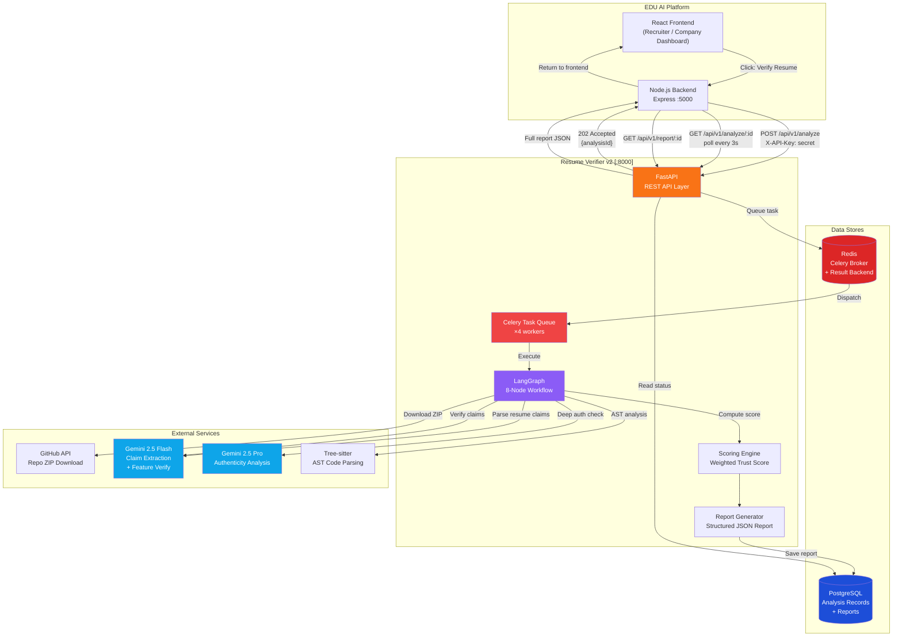
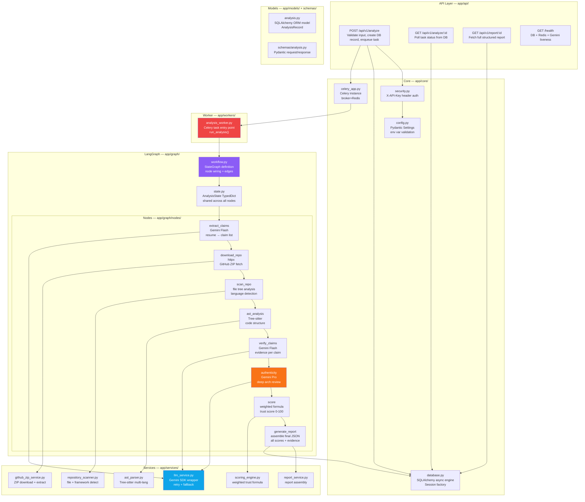
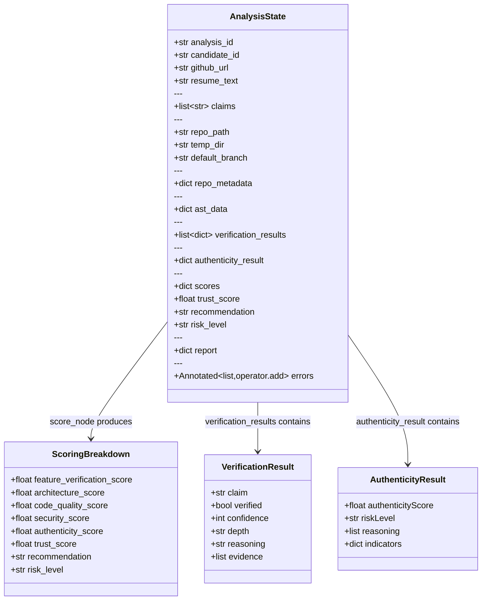

# Resume Verification Microservice v2

A production-grade, recruiter-focused GitHub repository verification engine.

**Stack:** FastAPI · LangGraph · LangChain · Gemini 2.5 Pro/Flash · PostgreSQL · Redis · Celery · Tree-sitter

---

## System Architecture



---

## Technical Architecture



---

## LangGraph Node Pipeline

```mermaid
graph LR
    A([Start]) --> B["extract_claims\nGemini Flash\nParse resume text\ninto structured claims"]
    B --> C["download_repo\nhttpx async\nGitHub ZIP archive"]
    C --> D["scan_repo\nFile tree walk\nLanguage + framework\ndetection"]
    D --> E["ast_analysis\nTree-sitter\nFunction / class\nextraction"]
    E --> F["verify_claims\nGemini Flash\nEvidence search\nper claim"]
    F --> G["authenticity\nGemini Pro\nDeep architectural\nauthenticity check"]
    G --> H["score\nWeighted formula\nTrust score 0-100"]
    H --> I["generate_report\nAssemble JSON\nwith all evidence"]
    I --> J([Save to PostgreSQL])

    style B fill:#0ea5e9,color:#fff
    style C fill:#22c55e,color:#fff
    style D fill:#22c55e,color:#fff
    style E fill:#22c55e,color:#fff
    style F fill:#0ea5e9,color:#fff
    style G fill:#f97316,color:#fff
    style H fill:#8b5cf6,color:#fff
    style I fill:#8b5cf6,color:#fff
```



---

## Trust Score Weights

| Component             | Weight |
|-----------------------|--------|
| Feature Verification  | 35%    |
| Architecture Quality  | 20%    |
| Code Quality          | 15%    |
| Security Quality      | 15%    |
| Authenticity          | 15%    |

---

## Prerequisites

- Python 3.12+
- PostgreSQL 15+ running locally
- Redis 7+ running locally
- Gemini API key (from [aistudio.google.com](https://aistudio.google.com))

---

## Setup

### 1. Create the database

```sql
-- Connect to PostgreSQL as superuser
CREATE DATABASE resume_verifier_v2;
```

### 2. Install dependencies

```bash
cd resume-verifier-v2
python -m venv .venv

# Windows
.venv\Scripts\activate

# macOS / Linux
source .venv/bin/activate

pip install -r requirements.txt
```

### 3. Configure environment

```bash
cp .env.example .env
# Edit .env and fill in:
#   GEMINI_API_KEY
#   API_KEY          (shared secret used by your Node.js backend)
#   DATABASE_URL     (update password if needed)
```

### 4. Run database migrations

```bash
alembic upgrade head
```

---

## Running the service

Open **three separate terminals** in the project root:

### Terminal 1 — Redis

```bash
redis-server
```

### Terminal 2 — FastAPI

```bash
uvicorn app.main:app --host 0.0.0.0 --port 8000 --reload
```

Set `DEBUG=true` in `.env` to enable Swagger UI at `http://localhost:8000/docs`.

### Terminal 3 — Celery Worker

```bash
celery -A app.core.celery_app worker --loglevel=info --concurrency=4
```

Optional — Celery task monitor:

```bash
celery -A app.core.celery_app flower --port=5555
```

---

## LangGraph StateGraph

```mermaid
flowchart TD
    START([__start__]) --> N1

    N1["**Node 1 — extract_claims**
    Model: Gemini 2.5 Flash
    Input:  resume_text
    Output: claims list[str]
    Fallback: regex FALLBACK_KEYWORDS"]

    N2["**Node 2 — download_repo**
    Tool: httpx async
    Input:  github_url
    Output: repo_path, temp_dir, default_branch
    Fallback: repo_path = None → conditional route"]

    N3["**Node 3 — scan_repo**
    Tool: file tree walk
    Input:  repo_path
    Output: repo_metadata
    Detects: languages, frameworks,
    hasTests, hasCi, maturityIndicators"]

    N4["**Node 4 — ast_analysis**
    Tool: Tree-sitter multi-lang
    Input:  repo_path
    Output: ast_data
    Extracts: functions, classes,
    services, controllers, middleware, models"]

    N5["**Node 5 — verify_claims**
    Model: Gemini 2.5 Flash
    Input:  claims, ast_data, repo_path
    Output: verification_results list[dict]
    Per claim: verified, confidence, depth, evidence[]"]

    N6["**Node 6 — authenticity**
    Model: Gemini 2.5 Pro
    Input:  repo_metadata, ast_data, sampled files 12
    Output: authenticity_result
    Fields: authenticityScore, riskLevel,
    reasoning[], indicators{}
    Fallback: heuristic scoring formula"]

    N7["**Node 7 — score**
    Tool: ScoringEngine.compute
    Input:  verification_results, ast_data,
    repo_metadata, authenticity_result
    Output: scores{}, trust_score, recommendation, risk_level
    Weights: FeatureVerify 35% · Arch 20% · CodeQuality 15% · Security 15% · Auth 15%"]

    N8["**Node 8 — generate_report**
    Tool: report_service.py
    Input:  full AnalysisState
    Output: report dict — all scores + evidence
    Saves: PostgreSQL analysis record"]

    END_([__end__])

    N1 --> N2
    N2 --> COND{repo_path\nexists?}

    COND -->|"Yes — happy path"| N3
    COND -->|"No — download failed\nskip scan + AST"| N6

    N3 --> N4
    N4 --> N5
    N5 --> N6
    N6 --> N7
    N7 --> N8
    N8 --> END_

    style N1 fill:#0ea5e9,color:#fff
    style N2 fill:#22c55e,color:#fff
    style N3 fill:#22c55e,color:#fff
    style N4 fill:#22c55e,color:#fff
    style N5 fill:#0ea5e9,color:#fff
    style N6 fill:#f97316,color:#fff
    style N7 fill:#8b5cf6,color:#fff
    style N8 fill:#8b5cf6,color:#fff
    style COND fill:#ef4444,color:#fff
    style START fill:#16a34a,color:#fff
    style END_ fill:#16a34a,color:#fff
```



---

## AnalysisState — Shared State Object



---

## API Reference

### POST /api/v1/analyze

Submit a candidate for verification.

**Header:** `X-API-Key: <your-api-key>`

```json
{
  "candidateId": "candidate-123",
  "githubUrl": "https://github.com/user/project",
  "resumeText": "Built AI chatbot with JWT auth, Redis caching, LangChain and Docker."
}
```

**Response (202):**
```json
{
  "analysisId": "550e8400-e29b-...",
  "status": "queued",
  "message": "Analysis queued successfully."
}
```

---

### GET /api/v1/analyze/{analysisId}

Poll for status.

**Response (200):**
```json
{
  "analysisId": "550e8400-...",
  "candidateId": "candidate-123",
  "status": "completed",
  "trustScore": 84.5,
  "recommendation": "Proceed to Technical Interview",
  "riskLevel": "LOW"
}
```

---

### GET /api/v1/report/{analysisId}

Full verification report (only available when `status == "completed"`).

**Response (200):**
```json
{
  "analysisId": "550e8400-...",
  "candidateId": "candidate-123",
  "repositorySummary": {
    "githubUrl": "https://github.com/user/project",
    "fileCount": 142,
    "languages": {"TypeScript": {"files": 89, "percentage": 62.7}},
    "frameworks": ["Express.js", "Socket.IO", "Redis"],
    "hasTests": true,
    "hasCi": true
  },
  "verifiedClaims": [
    {
      "claim": "JWT Authentication",
      "verified": true,
      "confidence": 97,
      "depth": "deep",
      "reasoning": "Full JWT implementation found: signing, verification, refresh tokens, and auth middleware.",
      "evidence": [
        {"file": "src/auth/auth.service.ts", "line": 24, "reason": "Pattern 'jwt.sign(' found"}
      ]
    }
  ],
  "missingClaims": ["Kubernetes"],
  "trustScore": 84.5,
  "qualityScore": 78.0,
  "authenticityScore": 82.0,
  "architectureScore": 90.0,
  "securityScore": 75.0,
  "recommendation": "Proceed to Technical Interview",
  "riskLevel": "LOW",
  "authenticityReasoning": [
    "Deep layered architecture: controllers, services, and models are clearly separated",
    "Comprehensive test coverage with Jest",
    "CI/CD pipeline configured with GitHub Actions"
  ]
}
```

---

### GET /health

```json
{
  "status": "ok",
  "service": "resume-verifier-v2",
  "database": "ok",
  "redis": "ok",
  "gemini": "ok"
}
```

---

## Testing

```bash
pytest
```

Run without LLM calls (all LLM services are mocked in tests):

```bash
pytest -x -q
```

---

## LangGraph Workflow Nodes

| Node | Model | Purpose |
|------|-------|---------|
| `extract_claims` | Gemini Flash | Parse resume → structured claim list |
| `download_repo` | — | Download + extract GitHub ZIP |
| `scan_repo` | — | Detect languages, frameworks, deps |
| `ast_analysis` | Tree-sitter | Extract code structure metadata |
| `verify_claims` | Gemini Flash | Evidence search + LLM reasoning per claim |
| `authenticity` | **Gemini Pro** | Deep architectural authenticity analysis |
| `score` | — | Weighted trust score computation |
| `generate_report` | — | Assemble final structured report |

---

## Environment Variables

| Variable | Description | Required |
|----------|-------------|----------|
| `DATABASE_URL` | Async PostgreSQL URL | Yes |
| `SYNC_DATABASE_URL` | Sync PostgreSQL URL (Celery) | Yes |
| `REDIS_URL` | Redis connection URL | Yes |
| `CELERY_BROKER_URL` | Celery broker | Yes |
| `CELERY_RESULT_BACKEND` | Celery result backend | Yes |
| `GEMINI_API_KEY` | Google Gemini API key | Yes |
| `GEMINI_PRO_MODEL` | Pro model ID | `gemini-2.5-pro` |
| `GEMINI_FLASH_MODEL` | Flash model ID | `gemini-2.5-flash` |
| `API_KEY` | Shared API key with Node.js backend | Yes |
| `MAX_REPO_SIZE_MB` | Max ZIP size to download | `500` |
| `DEBUG` | Enable debug logging + Swagger UI | `false` |
